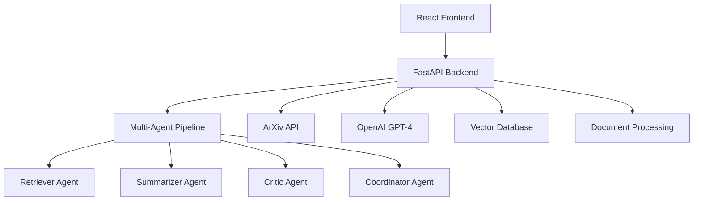

# 🚀 AI Research Intelligence Platform

**The Future of Academic Research & Knowledge Discovery**

[![Live Demo](https://img.shields.
[![Backend API](https://img.shields.io/badge/🛠%20API%20Docs-Swagger-green?style=for-thense-MIT-yellow.svg?style=for-the-Vision Statement**

Revolutionizing academic research through **Multi-Agent AI Intelligence** that transforms how researchers discover, analyze, and synthesize knowledge from millions of research papers worldwide.

***

## 🌟 **What Makes Us Different**

### **🤖 Multi-Agent AI Pipeline**
- **Retriever Agent** - Intelligent paper discovery
- **Summarizer Agent** - AI-powered analysis  
- **Critic Agent** - Quality validation & fact-checking
- **Coordinator Agent** - Orchestrated intelligence

### **🌍 Global Research Coverage**
Moving beyond just CS/AI to cover **ALL academic disciplines**:
- Physics, Medicine, Biology, Engineering
- Social Sciences, Mathematics, Chemistry
- Real-time ArXiv integration with 2M+ papers

### **📄 Advanced Document Analysis**
- **RAG-Powered PDF Processing** - Upload & analyze any research paper
- **Drag-and-Drop Interface** - Seamless document workflow
- **Multi-format Support** - PDF, DOC, DOCX, TXT
- **Intelligent Extraction** - Methods, results, conclusions

***

## 🏗️ **Architecture**



## 🚀 **Quick Start**

### **Prerequisites**
- Python 3.11+
- Node.js 18+
- OpenAI API Key

### **Backend Setup**
```bash
# Clone repository
git clone https://github.com/AyaanShaheer/ai-research-intelligence-platform.git
cd ai-research-intelligence-platform

# Backend dependencies
pip install -r requirements.txt

# Environment variables
cp .env.example .env
# Add your OPENAI_API_KEY

# Run backend
python -m src.main
```

### **Frontend Setup**
```bash
# Navigate to frontend
cd frontend

# Install dependencies
npm install

# Start development server
npm run dev
```

### **Access Application**
- **Frontend**: http://localhost:5173
- **Backend API**: http://localhost:8000
- **API Docs**: http://localhost:8000/docs

***

## 🌐 **Production Deployment**

### **Live URLs**
- **🌍 Production App**: https://ai-research-intelligence-platform.vercel.app
- **🔧 Backend API**: https://ai-research-intelligence-platform.onrender.com
- **📚 API Documentation**: https://ai-research-intelligence-platform.onrender.com/api/docs

### **Infrastructure**
- **Frontend**: Vercel (Auto-deployment from GitHub)
- **Backend**: Render (Free tier with auto-scaling)
- **Database**: PostgreSQL (planned)
- **Storage**: AWS S3 (for document uploads)

***

## 🛠️ **Technology Stack**

### **Backend**
- **FastAPI** - High-performance Python API
- **LangGraph** - Multi-agent orchestration
- **LangChain** - Document processing pipeline
- **OpenAI GPT-4** - Large language model
- **ArXiv API** - Research paper retrieval
- **Pydantic** - Data validation

### **Frontend**
- **React 18** - Modern UI framework
- **TypeScript** - Type-safe development
- **Material-UI** - Professional components
- **Vite** - Lightning-fast build tool
- **Axios** - API communication

### **AI & ML**
- **Multi-Agent Architecture** - Coordinated intelligence
- **Retrieval-Augmented Generation (RAG)** - Document analysis
- **Vector Embeddings** - Semantic search
- **Natural Language Processing** - Content understanding

***

## 📊 **Current Features**

### **✅ Research Intelligence**
- Multi-agent paper analysis
- Quality validation & fact-checking
- Professional research reports
- Performance metrics & analytics

### **✅ User Interface**
- Modern dark theme design
- Responsive Material-UI components
- Interactive research dashboard
- Real-time processing indicators

### **✅ System Capabilities**
- Concurrent user support
- Rate limiting & security
- Health monitoring
- Error handling & logging

***

## 🎯 **Roadmap**

### **🚧 Phase 1: Global Research Coverage (In Progress)**
- [ ] Real ArXiv API integration
- [ ] Multi-discipline research support
- [ ] Advanced search filters
- [ ] Citation network analysis
- [ ] Publication-quality report generation

### **📋 Phase 2: Document Analysis Engine (Next)**
- [ ] RAG-powered PDF processing
- [ ] Drag-and-drop file upload
- [ ] OCR for scanned documents
- [ ] Multi-format document support
- [ ] Intelligent content extraction

### **🎨 Phase 3: Enterprise Platform (Future)**
- [ ] User authentication & workspaces
- [ ] Research portfolio management
- [ ] Collaboration features
- [ ] API access for enterprise
- [ ] Advanced analytics dashboard

### **🚀 Phase 4: Advanced AI Features (Vision)**
- [ ] Research recommendation engine
- [ ] Automatic literature reviews
- [ ] Hypothesis generation
- [ ] Research gap identification
- [ ] Cross-paper comparison analysis

***

## 💼 **Business Model**

### **🆓 Researcher Tier (Free)**
- 10 research queries/month
- Basic AI summaries
- Community support

### **💼 Professional Tier ($29/month)**
- 200 research queries/month
- Advanced AI analysis
- PDF document processing
- Priority support

### **🏢 Enterprise Tier ($99/month)**
- Unlimited queries
- Custom workflows
- API access
- Analytics dashboard
- White-label options

***

## 📈 **Market Opportunity**

- **$399B SaaS Market** (2024) growing to $819B by 2030
- **Academic Research Market** - Underserved with massive potential
- **Target Users**: Researchers, graduate students, R&D teams, consulting firms
- **Competitive Advantage**: Multi-agent AI + global coverage + document analysis

---

## 🤝 **Contributing**

We welcome contributions! Please see our [Contributing Guidelines](CONTRIBUTING.md).

### **Development Workflow**
1. Fork the repository
2. Create feature branch (`git checkout -b feature/amazing-feature`)
3. Commit changes (`git commit -m 'Add amazing feature'`)
4. Push to branch (`git push origin feature/amazing-feature`)
5. Open Pull Request

***

## 📄 **License**

This project is licensed under the MIT License - see the [LICENSE](LICENSE) file for details.

***

## 🛟 **Support**
- **Email**: support@citeon.com

***

## 🏆 **Acknowledgments**

- **LangChain Team** - For the amazing framework
- **OpenAI** - For GPT-4 capabilities  
- **ArXiv** - For open access to research
- **Research Community** - For inspiration and feedback

***

## 📊 **Stats**

 -  [API Docs](https://ai-research-intelligence-platform.onrender.com/api/docs) -  [Report Bug](https://github.com/YOUR_USERNAME/ai-research-intelligence-platform/issues) -  [Request Feature](https://github.com/YOUR_USERNAME/ai-research-intelligence-platform/issues)

---

**Built with ❤️ by the AI Research Intelligence Team**

*Making academic research intelligent, one paper at a time*

</div>

***


[1](https://bestpitchdeck.com/AI/)
[2](https://pitch.com/presentations/collections/AI-Startups-5NiauR5EXT2G5199er52SAmo)
[3](https://www.canva.com/presentations/templates/pitch-deck/)
[4](https://slidebean.com/pitch-deck-examples)
[5](https://www.presentations.ai/presentation-templates/startup-pitch-deck)
[6](https://www.beautiful.ai/presentations/startup-pitch-deck)
[7](https://headline.com/blog-latest/article-latest/series-a-pitch-deck-template)
[8](https://www.figma.com/resource-library/pitch-deck-examples/)
[9](https://fi.co/pitch-deck)
[10](https://www.storydoc.com/pitch-deck-creator)
